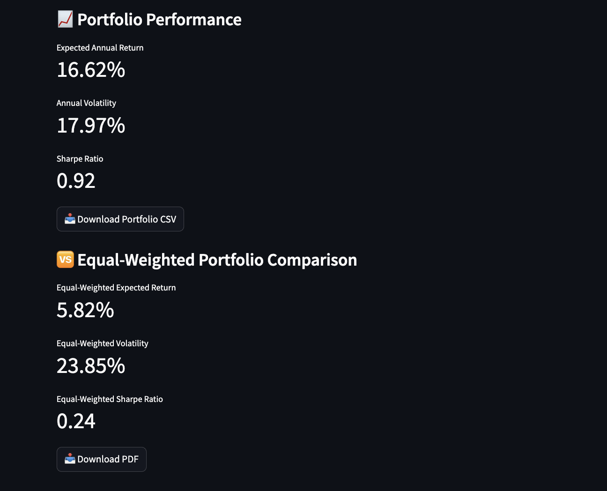

# 📈 AI-Powered Portfolio Optimization Tool

Welcome to the AI-Powered Portfolio Optimization Tool — a web application built using **Streamlit**, **Polygon.io**, and **PyPortfolioOpt** that helps users create optimized stock portfolios using **Modern Portfolio Theory**.

🔗 **Live App:** [Click to Launch](https://ai-powered-portfolio-optimization-tool.streamlit.app)

---

## 🚀 Overview

This tool allows users to:

- Select custom stock tickers
- Define a custom date range
- Control diversification using a max-weight slider
- View optimized portfolio allocations
- Compare with equal-weighted portfolio performance
- Export results as **CSV and PDF reports**

---

## ✨ Features

| Feature                         | Description                                                           |
|----------------------------------|-----------------------------------------------------------------------|
| 🔍 **Custom Ticker Input**       | Enter stock tickers like `AAPL, TSLA, MSFT` to define your portfolio |
| 📆 **Date Range Selection**      | Choose any historical window for analysis                            |
| 🎯 **Max Weight Slider**         | Limit exposure to individual stocks                                  |
| 📊 **Line & Pie Charts**         | Visualize stock trends and allocation split                          |
| 📈 **Optimization Engine**       | Maximize Sharpe Ratio using PyPortfolioOpt                           |
| 📥 **CSV + PDF Export**          | Download portfolio weights + performance summary                     |
| 🔁 **Equal-Weighted Comparison** | See how your optimized portfolio stacks up against a naive one       |

---

## 🧠 Optimization Logic

This app uses **Modern Portfolio Theory** via the [PyPortfolioOpt](https://github.com/robertmartin8/PyPortfolioOpt) library:

- Calculates expected returns using historical data
- Estimates risk with sample covariance matrix
- Uses convex optimization to maximize the **Sharpe Ratio**
- Allows user-defined weight bounds to reflect diversification preferences

---

## 📦 Tech Stack

- [Streamlit](https://streamlit.io/)
- [Polygon.io Market Data](https://polygon.io/)
- [PyPortfolioOpt](https://pyportfolioopt.readthedocs.io/)
- `pandas`, `matplotlib`, `fpdf`, `requests`

---

## 🛠️ How to Run Locally

```bash
git clone https://github.com/<your-username>/ai-powered-portfolio-optimization-tool.git
cd ai-powered-portfolio-optimization-tool
pip install -r requirements.txt
streamlit run portfolio_app.py
```

## 🔐 Setting Your API Key
To keep your Polygon API key secure, use one of the following:

✅ For Streamlit Cloud
Create a secrets file at .streamlit/secrets.toml and add:
toml
Copy
Edit
POLYGON_API_KEY = "your_actual_key_here"

✅ For Local Testing (Linux/Mac)
In your terminal before running the app:
bash
Copy
Edit
export POLYGON_API_KEY="your_actual_key_here"

Or for Windows PowerShell:
powershell
Copy
Edit
$env:POLYGON_API_KEY="your_actual_key_here"

📄 Sample Output

<p align="center">  </p>
<p align="center">  </p>
<p align="center">  </p>
<p align="center">  </p>

## 🙌 Acknowledgments
[Polygon.io](https://polygon.io/) for providing market data

[PyPortfolioOpt](https://pyportfolioopt.readthedocs.io/) for financial modeling

[Streamlit](https://streamlit.io/) for effortless UI deployment

## 📬 Author
Aarya Soni
🔗 [LinkedIn](www.linkedin.com/in/aaryasoni)
• 💼 [Live App](https://ai-powered-portfolio-optimization-tool.streamlit.app)


